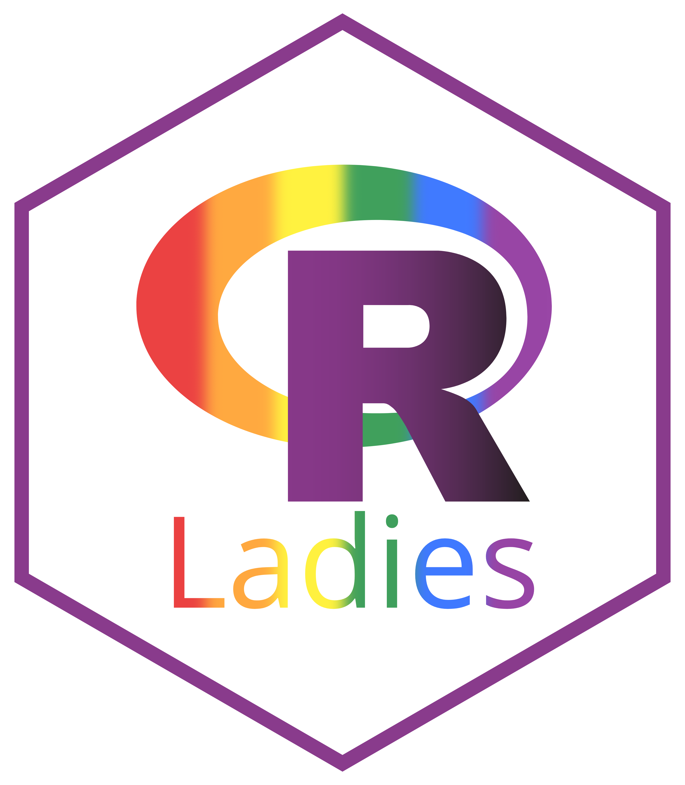

<!-- README.md is generated from README.Rmd. Please edit that file -->

# Rladies package workshop Montpellier 2020



This repository provides the presentation for the R ladies meeting in
Montpellier (02/2020) on how to create an R package. It contains many
links to useful resources.

# To get started

``` r
install.packages(c("devtools", "roxygen2", "usethis"))
library(devtools)
library(roxygen2)
library(usethis)
```

# Resources

  - Hadley Wickham’s book on R packages [link](http://r-pkgs.had.co.nz/)
    (Really it has everything you need\!)
  - Hillary Parker’s blog
    [post](https://hilaryparker.com/2014/04/29/writing-an-r-package-from-scratch/)
    on writing an R package is a great start\!
  - Everything you need to know about git and GitHub
    [link](https://happygitwithr.com/)
  - blog [post](https://juliasilge.com/blog/beginners-guide-to-travis/)
    by Julia Silge to get started with Travis-CI
  - The tidyverse style [guide](https://style.tidyverse.org/)
  - Packages to help you be stylish in R:
    [lintr](https://github.com/jimhester/lintr) and
    [styler](https://styler.r-lib.org/)
  - Add some complements: [praise](https://github.com/rladies/praise)
  - Blog by Emil Hvitfeldt on creating R packages with usethis
    [blog](https://www.hvitfeldt.me/blog/usethis-workflow-for-package-development/)
  - Presentation by Nicolas Casajus (in French :) )
    [link](https://frbcesab.github.io/datatoolbox/courses/r-packages/index.html)
  - [talk](https://resources.rstudio.com/rstudio-conf-2020/object-of-type-closure-is-not-subsettable-jenny-bryan)
    on debugging by Jenny
    Brian
  - [talk](https://resources.rstudio.com/rstudio-conf-2020/best-practices-for-programming-with-ggplot2-dewey-dunnington)
    on best practices for programming with ggplot2 by Dewey Dunnington
  - Submitting to [CRAN](https://cran.r-project.org/submit.html)
  - GitHub [actions](https://github.com/features/actions)
