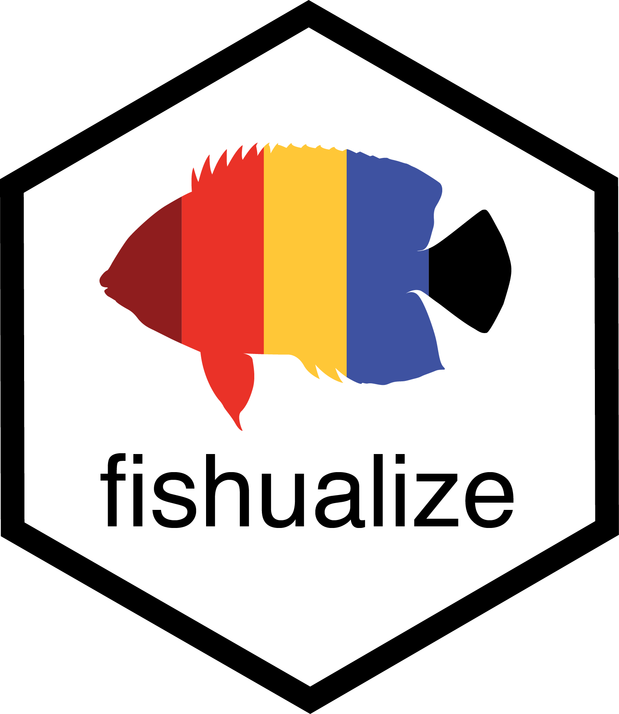
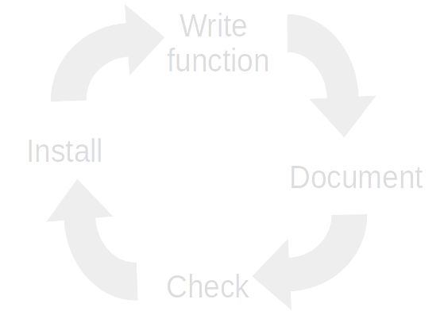
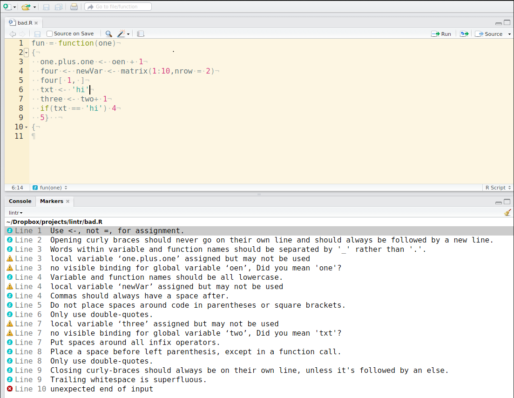

```{r setup, include=FALSE}
options(htmltools.dir.version = FALSE)
drake::clean()
```

```{r xaringan-themer, include=FALSE}
library(xaringanthemer)
duo(primary_color = "#00486DFF", secondary_color = "#8ECCBBFF",
  code_font_family = "Fira Code",
  code_font_url    = "https://cdn.rawgit.com/tonsky/FiraCode/1.204/distr/fira_code.css"
)
```

# How to transfigure your code into an R package
<br>
<br>

.center[]

---
# Who has ever copypasted pieces of code? 

.center[]
---
**I used to think writing R packages was for advanced R wizards...**
<br>
<br>
<br>
<br>


.center[]
---
**Then one day I discovered that I too can develop R packages...**

.center[]
.center[
  
]
--

.pull-left[** ... although not without difficulties! **
.center[]]
--
.pull-right[
** Here's what I learned so far... **
.center[]
]
--


class: center

---
# On the menu


<br>

1) What is an R package and why do you want to make one?

--

<br>

2) How does it work? 

--

<br>

3) Coding time!

---
class: inverse, center, middle

# What is an R package?

---
# What is an R package?
                    
.pull-left[
              
- "*In R, the fundamental unit of shareable code is the package. A package bundles together code, data, documentation, and tests, and is easy to share with others.*" __ Hadley Wickham

- There are now (9-01-2020) 15356 R packages on CRAN (Comprehensive R Archive Network) and many more on GitHub and Bioconductor!
]
.pull-right[
.center[]
]

--

"*Seriously, it doesn’t have to be about sharing your code. It is about saving yourself time.*" __ Hillary Parker


Hillary Parker's blog [post](https://hilaryparker.com/2014/04/29/writing-an-r-package-from-scratch/) on writing an R package is a great start!


---
# The Sisyphean workflow
.pull-left[
1) Write some code   
2) Copy piece of code   
3) Change some details  
4) Start over   
] 
.pull-right[
]

--
```{r}
df <- data.frame(a = rnorm(10), 
                 b = rnorm(10), 
                 c = rnorm(10), 
                 d = rnorm(10))

df$a <- (df$a - min(df$a, na.rm = TRUE)) / 
  (max(df$a, na.rm = TRUE) - min(df$a, na.rm = TRUE))
df$b <- (df$b - min(df$b, na.rm = TRUE)) / 
  (max(df$b, na.rm = TRUE) - min(df$a, na.rm = TRUE))
df$c <- (df$c - min(df$c, na.rm = TRUE)) / 
  (max(df$c, na.rm = TRUE) - min(df$c, na.rm = TRUE))
df$d <- (df$d - min(df$d, na.rm = TRUE)) / 
  (max(df$d, na.rm = TRUE) - min(df$d, na.rm = TRUE))
```


---


# Optimize your workflow

**functions** make your code reusable!     

.pull-left[
   
   
   
Three key steps to creating a new function:
- name
- arguments
- body

]

.pull-right[
```{r, eval = FALSE}
# Create function
normalize <- function(x){
  min <- min(x, na.rm = TRUE)
  max <- max(x, na.rm = TRUE)
  (x - min)/(max - min)
}
# Apply function
normalize(df$a)
```
]

---
      
       
# R package 


.pull-left[

- An R package is a collection of functions 


- Make your life easier


- Makes your work more reproducible


- Make your code useful for others


- It's a lot of fun!

]
--
.pull-right[
.center[
**Workflow**



]
]
---

class: inverse, center, middle

# How does it work?


---
# Package structure 

```
mypackage.Rproj
|___DESCRIPTION
|___NAMESPACE
|___README.md
|___data/
|
|___R/
|   |___my_function1.R
|   |___my_function2.R
|   |___my_function3.R
|
|___man/
|   |___my_function1.Rd
|   |___my_function2.Rd
|   |___my_function3.Rd
|
|___vignettes/
|    |___my_vignette.Rmd
|
|___.Rbuildignore
```

---
# R/

```{r, eval = TRUE}

normalize <- function(x){
  min <- min(x, na.rm = TRUE)
  max <- max(x, na.rm = TRUE)
 (x - min)/(max - min)
}

```
---
# R/

**Document!!!!**

```{r, eval = FALSE}
#' @title Normalization of a numeric vector
#'
#' @description Creates normalized values of a vector 
#'
#' @param x A numeric vector
#' @return vector of normalized values
#' @export
#' @example 
#' normalize(c(1,2,3,4,5))

normalize <- function(x){
  min <- min(x, na.rm = TRUE)
  max <- max(x, na.rm = TRUE)
  (x - min)/(max - min)
}

```
extra:
```{r, eval = FALSE}
#' @import
#' @importFrom
```

---
# R/

**Beware of the error! **

```{r, error = TRUE}
normalize(c(0, 2, 1, 10, 5, "a"))
```

.center[]

---
# R/

```{r, eval = TRUE, error = TRUE}
normalize <- function(x){
  
  if(!is.numeric(x)){
    stop("x must be a numeric vector")
  }
  if(length(x) == 1){
    warning("x has length 1, will return NA")
  }
  
  min <- min(x, na.rm = TRUE)
  max <- max(x, na.rm = TRUE)
  (x - min)/(max - min)
}

normalize(c(0, 2, 1, 10, 5, "a"))
normalize(c(3))
```
---
# man/
```{r, eval=FALSE}
devtools::document()
roxygen2::roxygenize()
```

```
|___R/
|   |___my_function1.R
|   |___my_function2.R
|   |___my_function3.R
|
|___man/
|   |___my_function1.Rd
|   |___my_function2.Rd
|   |___my_function3.Rd
```


---

# DESCRIPTION
```
Package: my_package_name
Type: Package
Title: A beautiful package to do cool things
Version: 0.0.999
Authors@R: c(
    person("Nina", "Schiettekatte", 
    email = "nina.schiettekatte@gmail.com", 
    role = c("cre", "aut")))
Description: This is a package to do cool things.
License: GPL-2
Encoding: UTF-8
LazyData: true
Depends:
    R (>= 2.10)
Suggests:
    testthat,
    knitr,
    rmarkdown,
    rfishbase
Imports: 
    ggplot2 (>= 1.0.1),
    dplyr
RoxygenNote: 6.1.1
```
---
# Namespace
```
# Generated by roxygen2: do not edit by hand

export(fish)
export(fish_pal)
export(fish_palettes)
export(fishualize)
export(scale_color_fish)
export(scale_color_fish_d)
export(scale_colour_fish)
export(scale_colour_fish_d)
export(scale_fill_fish)
export(scale_fill_fish_d)
importFrom(ggplot2,discrete_scale)
importFrom(ggplot2,scale_color_gradientn)
importFrom(ggplot2,scale_fill_gradientn)
importFrom(graphics,image)
importFrom(gridExtra,grid.arrange)
```
---
# Workflow   

.pull-left[

1) Set up project

2) Add a function with roxygen header
    
3) devtools::document()
     
4) devtools::load_all()  
    
5) check manually + devtools::check()  
    
6) devtools::install()

7) Go back to step 2

] 
--
.pull-right[
Hooray! A basic functioning package!
   

But there is more...
]
---
# Use version control! 

**Git** is a version control system   
--> Track changes

```{r, eval = FALSE}
usethis::use_git()
```
   
**GitHub** (or Bitbucket or GitLab) is a hosting service for your git-based project on the internet
- Like a back up for your r projects with a memory
- Share your code
- Collaborate with others

(It's like dropbox but a lot better!)
  
```{r, eval = FALSE}
usethis::use_github()
```

Check out this [link](https://happygitwithr.com/) for a great guide for using Git and GitHub with R by Jenny Brian and Jim Hester

---
# Continuous integration with travis

.pull-left[
- Every time you push a a commit to GitHub, travis R CMD check will run behind the scene
- Allows you to automatically check your package on other platforms (such as ubuntu)
- Gives you a beautiful green badge on GitHub      
]
.pull-right[
.center[

]
]
--
.center[
]
- See blog [post](https://juliasilge.com/blog/beginners-guide-to-travis/) by Julia Silge for a beginner's guide to Travis-CI for R
- Brand new alternative: GitHub [actions](https://github.com/features/actions)


---
# Add a README

The goal of the README.md is to answer the following questions about your package:

- Why should I use it? 
- How do I use it?
- How do I get it?
     
On GitHub, the README.md will be rendered as HTML and displayed on the repository home page


```{r, eval = FALSE}
usethis::use_readme_rmd()
```

---
# Vignettes

A vignette is a long-form guide to your package
   

```{r, eval=FALSE}
usethis::use_vignette("name", title = "my_title")
devtools::build_vignettes()
```

To browse existing vignettes:
```{r, eval=FALSE}
browseVignettes("packagename")
```
[example](https://cran.r-project.org/web/packages/dplyr/vignettes/dplyr.html): introduction to dplyr

---

# Advanced testing

.pull-left[
```{r, eval = FALSE}
usethis::use_testthat()
usethis::use_test("name") 
```

]
.pull-right[
.center[
]]
--
Example test in stringr on function **str_length()**
```{r, eval = FALSE}
context("String length")

test_that("str_length is number of characters", {
  expect_equal(str_length("a"), 1)
  expect_equal(str_length("ab"), 2)
  expect_equal(str_length("abc"), 3)
})
```
    
Run **devtools::test()** to perform all your tests
   
Check out this [chapter](http://r-pkgs.had.co.nz/tests.html) on testing inside the book on R packages by Hadley Wickham

---
# Note on style

.pull-left[
- Good coding style is like correct punctuation   
 
- Unspoken rules  
  
- Makes code easier to read AND write

- Spacing!!!

- Lines of code shouldn't be too long
]

.pull-right[
.center[

]]

---
# Note on style

.pull-left[
The tidyverse style [guide](https://style.tidyverse.org/) contains everything you need to know!
       
Packages to help you: 
      
- [lintr](https://github.com/jimhester/lintr) performs automated checks to confirm that you conform to the style guide    
             
- [styler](https://styler.r-lib.org/) allows you to interactively restyle selected text, files, or entire projects
]
.pull-right[
 
]
---
# Note on style  
       



---
# Create a website
   
```{r, eval = FALSE}
pkgdown::build_site()
```

For example: [link](https://nschiett.github.io/fishualize/index.html)

---
# Note on tidyverse programming 
```{r, eval = FALSE}
library(ggplot2)
custom_plot <- function(data, var_x, var_y, var_fill){
  ggplot(data) +
    geom_boxplot(aes(x = var_x, y = var_y, fill = var_fill))
}

custom_plot(mpg, class, hwy, drv)
## Error in FUN(X[[i]], ...): object 'hwy' not found
```

```{r, eval = FALSE}
## Solution: use .data[[]]
custom_plot <- function(data, var_x, var_y, var_fill){
  ggplot(data) +
    geom_boxplot(aes(x = .data[[var_x]], y = .data[[var_y]], 
                     fill = .data[[var_fill]])) +
    labs(x = var_x, y = var_y, fill = var_fill)
}
custom_plot(mpg, "class", "hwy", "drv")
```

---
# Add some niceness

Build friendly R packages that praise their users if they have done something good with [praise](https://github.com/rladies/praise)

```{r, eval = FALSE}
devtools::install_github("gaborcsardi/praise")
```

```{r}
library(praise)
praise()
```
     
You can supply a template, and praise() fills in random words of the specified part of speech:
    
```{r}
praise("${EXCLAMATION}! You have done this ${adverb_manner}!")
```

---
### Recap: devtools & roxygen2 & usethis
```{r, eval = FALSE}
# one time set up
usethis::create_package("~/mypath/mypackage")
usethis::use_git()
usethis::use_github()
usethis::use_mit_license() # or other
usethis::use_readme_rmd()
usethis::use_travis()
usethis::use_testthat()
usethis::use_data_raw()
# develop
usethis::use_r("function_name")
devtools::document()
devtools::load_all()
devtools::check()
devtools::install()
# more
usethis::use_data(dataframe)  
usethis::use_test("function_name")
devtools::test()
usethis::use_package("dplyr") 
usethis::use_vignette("How to do this cool analysis")
pkgdown::build_site()
```

See Emil Hvitfeldt's [blog](https://www.hvitfeldt.me/blog/usethis-workflow-for-package-development/) and Nicolas Casajus' [presentation](https://frbcesab.github.io/datatoolbox/courses/r-packages/index.html)
---
# Resources
- Hadley Wickham's book on R packages [link](http://r-pkgs.had.co.nz/) (Really it has everything you need!)
- Hillary Parker's blog [post](https://hilaryparker.com/2014/04/29/writing-an-r-package-from-scratch/) on writing an R package is a great start!
- Everything you need to know about git and GitHub [link](https://happygitwithr.com/) 
- blog [post](https://juliasilge.com/blog/beginners-guide-to-travis/) by Julia Silge to get started with Travis-CI 
- The tidyverse style [guide](https://style.tidyverse.org/) 
- Packages to help you be stylish in R:  [lintr](https://github.com/jimhester/lintr) and  [styler](https://styler.r-lib.org/) 
- Add some complements: [praise](https://github.com/rladies/praise)
- Blog by Emil Hvitfeldt on creating R packages with usethis [blog](https://www.hvitfeldt.me/blog/usethis-workflow-for-package-development/)
- Presentation by Nicolas Casajus (in French :) ) [link](https://frbcesab.github.io/datatoolbox/courses/r-packages/index.html)
- [talk](https://resources.rstudio.com/rstudio-conf-2020/object-of-type-closure-is-not-subsettable-jenny-bryan) on debugging by Jenny Brian
- [talk](https://resources.rstudio.com/rstudio-conf-2020/best-practices-for-programming-with-ggplot2-dewey-dunnington) on best practices for programming with ggplot2 by Dewey Dunnington
- Submitting to [CRAN](https://cran.r-project.org/submit.html)
- GitHub [actions](https://github.com/features/actions)
---
class: inverse, center, middle

# Now let's make an R package!


